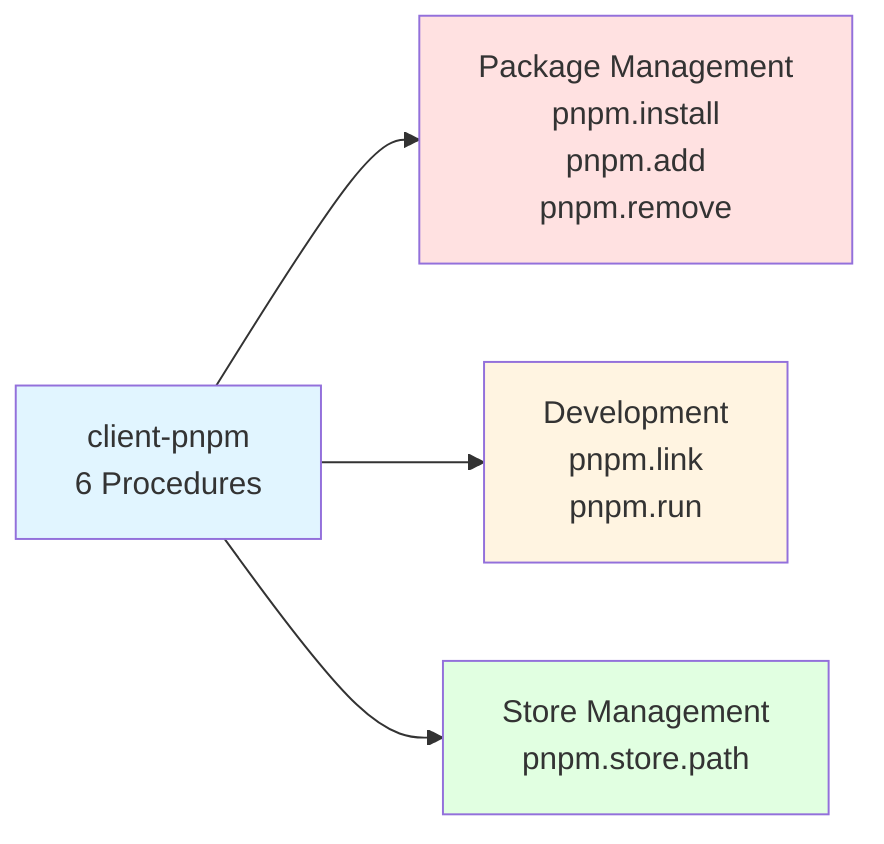

# @mark1russell7/client-pnpm

[](https://www.npmjs.com/package/@mark1russell7/client-pnpm)
[](https://opensource.org/licenses/MIT)

> PNPM package manager wrapper - exposes `pnpm.install`, `pnpm.add`, `pnpm.remove`, `pnpm.link`, `pnpm.run`, and `pnpm.store.path` as type-safe RPC procedures.

## Overview

`@mark1russell7/client-pnpm` wraps pnpm package manager commands as RPC procedures through the client system. It provides 6 procedures for package management operations including installation, adding/removing packages, linking local packages, running scripts, and accessing the pnpm store.

This package follows the **CLI Wrapper Pattern** using `client-shell` for command execution with full type safety via Zod schemas.

## Architecture

```mermaid
graph TB
    A[client-pnpm] -->|uses| B[client-shell]
    A -->|depends on| C[@mark1russell7/client]
    A -->|validates with| D[zod]

    E[Application] -->|calls| F[pnpm.* procedures]
    F -->|builds command| G[pnpm CLI]
    F -->|calls| H[shell.run]
    H -->|executes| G

    I[pnpm.install] -.-> F
    J[pnpm.add/remove] -.-> F
    K[pnpm.link] -.-> F
    L[pnpm.run] -.-> F
    M[pnpm.store.path] -.-> F

    style A fill:#e1f5ff
    style B fill:#ffe1e1
    style F fill:#e1ffe1
```

### Procedure Categories



## Installation

```bash
# Using pnpm (recommended)
pnpm add @mark1russell7/client-pnpm

# Using npm
npm install @mark1russell7/client-pnpm

# Using yarn
yarn add @mark1russell7/client-pnpm
```

## Quick Start

```typescript
import { Client } from "@mark1russell7/client";
import "@mark1russell7/client-pnpm/register.js";

const client = new Client();

// Install all dependencies
await client.call(["pnpm", "install"], {
  cwd: "/path/to/project",
});

// Add a dev dependency
await client.call(["pnpm", "add"], {
  packages: ["typescript", "@types/node"],
  dev: true,
});

// Run a script
await client.call(["pnpm", "run"], {
  script: "build",
});
```

## API Reference

### Procedures

#### `pnpm.install`

Install dependencies from package.json or specific packages.

**Path:** `["pnpm", "install"]`

```typescript
interface PnpmInstallInput {
  /** Packages to install. If not provided, installs from package.json */
  packages?: string[];

  /** Save as dev dependency */
  dev?: boolean;

  /** Use frozen lockfile (--frozen-lockfile) */
  frozen?: boolean;

  /** Working directory */
  cwd?: string;

  /** Timeout in milliseconds */
  timeout?: number;
}

interface PnpmCommandOutput {
  /** Exit code of the command */
  exitCode: number;

  /** Standard output */
  stdout: string;

  /** Standard error */
  stderr: string;

  /** Whether command succeeded (exit code 0) */
  success: boolean;

  /** Duration in milliseconds */
  duration: number;
}
```

**Examples:**
```typescript
// Install all from lockfile (CI mode)
await client.call(["pnpm", "install"], {
  frozen: true,
  cwd: "/my/project",
});

// Install specific packages
await client.call(["pnpm", "install"], {
  packages: ["lodash", "zod"],
  dev: true,
});

// Install all dependencies
await client.call(["pnpm", "install"], {});
```

#### `pnpm.add`

Add packages to the project.

**Path:** `["pnpm", "add"]`

```typescript
interface PnpmAddInput {
  /** Packages to add */
  packages: string[];

  /** Save as dev dependency */
  dev?: boolean;

  /** Install globally */
  global?: boolean;

  /** Working directory */
  cwd?: string;

  /** Timeout in milliseconds */
  timeout?: number;
}
```

**Examples:**
```typescript
// Add production dependencies
await client.call(["pnpm", "add"], {
  packages: ["express", "cors"],
});

// Add dev dependencies
await client.call(["pnpm", "add"], {
  packages: ["vitest", "@vitest/coverage-v8", "typescript"],
  dev: true,
});

// Add global tool
await client.call(["pnpm", "add"], {
  packages: ["typescript"],
  global: true,
});

// Add with version
await client.call(["pnpm", "add"], {
  packages: ["react@18", "react-dom@18"],
});
```

#### `pnpm.remove`

Remove packages from the project.

**Path:** `["pnpm", "remove"]`

```typescript
interface PnpmRemoveInput {
  /** Packages to remove */
  packages: string[];

  /** Remove from global */
  global?: boolean;

  /** Working directory */
  cwd?: string;

  /** Timeout in milliseconds */
  timeout?: number;
}
```

**Examples:**
```typescript
// Remove packages
await client.call(["pnpm", "remove"], {
  packages: ["old-package", "unused-lib"],
});

// Remove global package
await client.call(["pnpm", "remove"], {
  packages: ["typescript"],
  global: true,
});
```

#### `pnpm.link`

Link local packages for development.

**Path:** `["pnpm", "link"]`

```typescript
interface PnpmLinkInput {
  /** Path to package to link. If not provided, links current directory globally */
  path?: string;

  /** Link globally */
  global?: boolean;

  /** Working directory */
  cwd?: string;

  /** Timeout in milliseconds */
  timeout?: number;
}
```

**Examples:**
```typescript
// Link current directory globally
await client.call(["pnpm", "link"], {
  global: true,
  cwd: "/path/to/my-package",
});

// Link a local package into current project
await client.call(["pnpm", "link"], {
  path: "../my-local-package",
});

// Link from global to current project
await client.call(["pnpm", "link"], {
  path: "my-global-package",
  global: true,
});
```

#### `pnpm.run`

Run package.json scripts.

**Path:** `["pnpm", "run"]`

```typescript
interface PnpmRunInput {
  /** Script name to run */
  script: string;

  /** Additional arguments to pass to the script */
  args?: string[];

  /** Working directory */
  cwd?: string;

  /** Timeout in milliseconds */
  timeout?: number;
}
```

**Examples:**
```typescript
// Run build script
await client.call(["pnpm", "run"], {
  script: "build",
});

// Run test with arguments
await client.call(["pnpm", "run"], {
  script: "test",
  args: ["--coverage", "--watch"],
});

// Run custom script in specific directory
await client.call(["pnpm", "run"], {
  script: "deploy",
  cwd: "/path/to/project",
  timeout: 600000, // 10 minutes
});
```

#### `pnpm.store.path`

Get the pnpm store path for snapshot/restore operations.

**Path:** `["pnpm", "store", "path"]`

```typescript
interface PnpmStorePathInput {
  /** Working directory (affects store path on some configurations) */
  cwd?: string;
}

interface PnpmStorePathOutput {
  /** Absolute path to the pnpm store */
  path: string;

  /** Whether store exists */
  exists: boolean;

  /** Platform (win32, darwin, linux) */
  platform: string;
}
```

**Example:**
```typescript
const store = await client.call(["pnpm", "store", "path"], {});
console.log(`PNPM store: ${store.path}`);
console.log(`Exists: ${store.exists}`);
console.log(`Platform: ${store.platform}`);
```

## Complete Procedure List

| Procedure | Description |
|-----------|-------------|
| `pnpm.install` | Install dependencies from package.json/lockfile |
| `pnpm.add` | Add packages to project |
| `pnpm.remove` | Remove packages from project |
| `pnpm.link` | Link local packages for development |
| `pnpm.run` | Run package.json scripts |
| `pnpm.store.path` | Get pnpm store path |

## Usage Examples

### CI/CD Pipeline

```typescript
// Frozen install for reproducible builds
const install = await client.call(["pnpm", "install"], {
  frozen: true,
  cwd: "./project",
});

if (!install.success) {
  throw new Error(`Install failed: ${install.stderr}`);
}

// Run tests
await client.call(["pnpm", "run"], {
  script: "test",
  args: ["--coverage"],
});

// Build
await client.call(["pnpm", "run"], {
  script: "build",
});
```

### Development Workflow

```typescript
// Add dependencies
await client.call(["pnpm", "add"], {
  packages: ["react", "react-dom"],
});

await client.call(["pnpm", "add"], {
  packages: ["@types/react", "@types/react-dom", "vite"],
  dev: true,
});

// Link local packages
await client.call(["pnpm", "link"], {
  path: "../shared-components",
});

// Start dev server
await client.call(["pnpm", "run"], {
  script: "dev",
});
```

### Monorepo Package Management

```typescript
// Install all workspace packages
await client.call(["pnpm", "install"], {
  cwd: "/monorepo/root",
});

// Add dependency to specific package
await client.call(["pnpm", "add"], {
  packages: ["lodash"],
  cwd: "/monorepo/root/packages/utils",
});

// Build all packages in dependency order
await client.call(["pnpm", "run"], {
  script: "build",
  args: ["--recursive"],
  cwd: "/monorepo/root",
});
```

### Global Package Management

```typescript
// Install global tool
await client.call(["pnpm", "add"], {
  packages: ["typescript", "ts-node"],
  global: true,
});

// Link package globally for testing
await client.call(["pnpm", "link"], {
  global: true,
  cwd: "/path/to/my-cli-tool",
});

// Remove global package
await client.call(["pnpm", "remove"], {
  packages: ["old-cli"],
  global: true,
});
```

### Store Management

```typescript
// Get store path for backup/restore
const store = await client.call(["pnpm", "store", "path"], {});
console.log(`Backing up store: ${store.path}`);

// Could be used to:
// - Backup store for faster CI builds
// - Share store between CI jobs
// - Clean old cached packages
if (store.exists) {
  // Perform backup/cleanup operations
}
```

## Types & Schemas

All input types have corresponding Zod schemas for validation:

```typescript
import {
  PnpmInstallInputSchema,
  PnpmAddInputSchema,
  PnpmRemoveInputSchema,
  PnpmLinkInputSchema,
  PnpmRunInputSchema,
  PnpmStorePathInputSchema,
  type PnpmInstallInput,
  type PnpmAddInput,
  type PnpmRemoveInput,
  type PnpmLinkInput,
  type PnpmRunInput,
  type PnpmStorePathInput,
  type PnpmCommandOutput,
  type PnpmStorePathOutput,
} from "@mark1russell7/client-pnpm";
```

## Functions

```typescript
// Low-level procedure functions
export async function pnpmInstall(
  input: PnpmInstallInput,
  ctx: ProcedureContext
): Promise<PnpmCommandOutput>;

export async function pnpmAdd(
  input: PnpmAddInput,
  ctx: ProcedureContext
): Promise<PnpmCommandOutput>;

export async function pnpmRemove(
  input: PnpmRemoveInput,
  ctx: ProcedureContext
): Promise<PnpmCommandOutput>;

export async function pnpmLink(
  input: PnpmLinkInput,
  ctx: ProcedureContext
): Promise<PnpmCommandOutput>;

export async function pnpmRun(
  input: PnpmRunInput,
  ctx: ProcedureContext
): Promise<PnpmCommandOutput>;

export async function pnpmStorePath(
  input: PnpmStorePathInput
): Promise<PnpmStorePathOutput>;

// Registration function
export function registerPnpmProcedures(): void;
```

## Configuration

### Package.json Client Field

```json
{
  "client": {
    "procedures": "./dist/register.js"
  },
  "scripts": {
    "postinstall": "client announce"
  }
}
```

### Build Scripts

```bash
# Build the package
pnpm build

# Type check
pnpm typecheck

# Clean build artifacts
pnpm clean
```

## Dependencies

```mermaid
graph LR
    A[@mark1russell7/client-pnpm] --> B[@mark1russell7/client]
    A --> C[@mark1russell7/client-shell]
    A --> D[zod]

    B -.->|provides| E[Client & Procedure System]
    C -.->|provides| F[shell.run procedure]
    D -.->|provides| G[Schema Validation]

    style A fill:#e1f5ff
    style B fill:#ffe1e1
    style C fill:#ffe1e1
    style D fill:#fff4e1
```

- **`@mark1russell7/client`** - Core client library providing the procedure system
- **`@mark1russell7/client-shell`** - Generic shell execution wrapper
- **`zod`** - Schema validation library

## Integration with Ecosystem

### Used By

```typescript
// bundle-dev/src/register.ts
import "@mark1russell7/client-pnpm/register.js";

// client-lib uses pnpm procedures for package management
import { pnpmInstall, pnpmRun } from "@mark1russell7/client-pnpm";
```

### Usage in client-lib

The `client-lib` package uses pnpm procedures for ecosystem package management:

```typescript
// Install dependencies in a package
await ctx.client.call(["pnpm", "install"], {
  cwd: packagePath,
  frozen: true,
});

// Build a package
await ctx.client.call(["pnpm", "run"], {
  script: "build",
  cwd: packagePath,
});
```

## CLI Wrapper Pattern

`client-pnpm` follows the ecosystem's **CLI Wrapper Pattern**:

1. **Multiple Focused Procedures** - Each procedure wraps a specific pnpm command
2. **Shell Delegation** - Uses `client-shell` for command execution
3. **Consistent Output** - Returns standardized `PnpmCommandOutput`
4. **Type Safety** - Full TypeScript types and Zod validation

This pattern is also used by:
- `client-cli` - Mark CLI wrapper
- `client-git` - Git operations wrapper

## Advanced Usage

### Direct Function Imports

```typescript
import { pnpmInstall, pnpmAdd, pnpmRun } from "@mark1russell7/client-pnpm";
import { Client } from "@mark1russell7/client";

const client = new Client();
const ctx = { client };

await pnpmInstall({ frozen: true }, ctx);
await pnpmAdd({ packages: ["lodash"] }, ctx);
await pnpmRun({ script: "build" }, ctx);
```

### Custom Registration

```typescript
import { createProcedure, registerProcedures } from "@mark1russell7/client";
import { pnpmInstall, PnpmInstallInputSchema } from "@mark1russell7/client-pnpm";

// Register under custom namespace
const customInstallProcedure = createProcedure()
  .path(["custom", "pnpm", "install"])
  .input(PnpmInstallInputSchema)
  .handler(pnpmInstall)
  .build();

registerProcedures([customInstallProcedure]);
```

### Error Handling

```typescript
try {
  const result = await client.call(["pnpm", "install"], {
    frozen: true,
  });

  if (!result.success) {
    console.error(`Install failed with exit code ${result.exitCode}`);
    console.error(`stderr: ${result.stderr}`);

    if (result.stderr.includes("ERR_PNPM_OUTDATED_LOCKFILE")) {
      console.log("Lockfile is outdated. Run pnpm install without --frozen-lockfile.");
    }
  }
} catch (error) {
  console.error("Procedure call failed:", error);
}
```

## Performance Considerations

- **Process Spawning**: Each call spawns a pnpm process
- **Lockfile Parsing**: Large lockfiles may slow down operations
- **Frozen Installs**: Use `frozen: true` in CI for faster, reproducible installs
- **Workspace Filtering**: Use pnpm's native workspace filtering for monorepos
- **Store Location**: Consider store location for performance (local vs network drive)

## Troubleshooting

### PNPM Not Found

Ensure pnpm is installed and in PATH:
```bash
pnpm --version
```

Install pnpm:
```bash
npm install -g pnpm
```

### Lockfile Issues

If you get lockfile errors:
```typescript
// Update lockfile
await client.call(["pnpm", "install"], {
  // Don't use frozen: true
});

// Or delete lockfile and reinstall
await client.call(["pnpm", "install"], {});
```

### Permission Errors

Check directory permissions:
```bash
ls -la node_modules
```

### Store Issues

Check store path and permissions:
```typescript
const store = await client.call(["pnpm", "store", "path"], {});
console.log(`Store: ${store.path}, Exists: ${store.exists}`);
```

## PNPM Features

### Workspace Support

PNPM workspaces are supported through the `cwd` parameter:

```typescript
// Install all workspace packages
await client.call(["pnpm", "install"], {
  cwd: "/workspace/root",
});

// Add to specific workspace package
await client.call(["pnpm", "add"], {
  packages: ["lodash"],
  cwd: "/workspace/root/packages/utils",
});
```

### Script Arguments

Pass arguments to pnpm scripts:

```typescript
await client.call(["pnpm", "run"], {
  script: "test",
  args: ["--", "--coverage", "--watch"],
});
// Runs: pnpm run test -- --coverage --watch
```

### Version Specifiers

Use standard pnpm version syntax:

```typescript
await client.call(["pnpm", "add"], {
  packages: [
    "react@^18.0.0",
    "lodash@latest",
    "@types/node@*",
    "my-package@workspace:*", // Workspace package
  ],
});
```

## License

MIT

## Related Packages

- [@mark1russell7/client](https://github.com/mark1russell7/client) - Core client library
- [@mark1russell7/client-shell](https://github.com/mark1russell7/client-shell) - Shell execution wrapper
- [@mark1russell7/client-lib](https://github.com/mark1russell7/client-lib) - Library management (uses pnpm procedures)
- [@mark1russell7/client-cli](https://github.com/mark1russell7/client-cli) - CLI wrapper
- [@mark1russell7/client-git](https://github.com/mark1russell7/client-git) - Git operations wrapper
- [@mark1russell7/bundle-dev](https://github.com/mark1russell7/bundle-dev) - Development bundle
